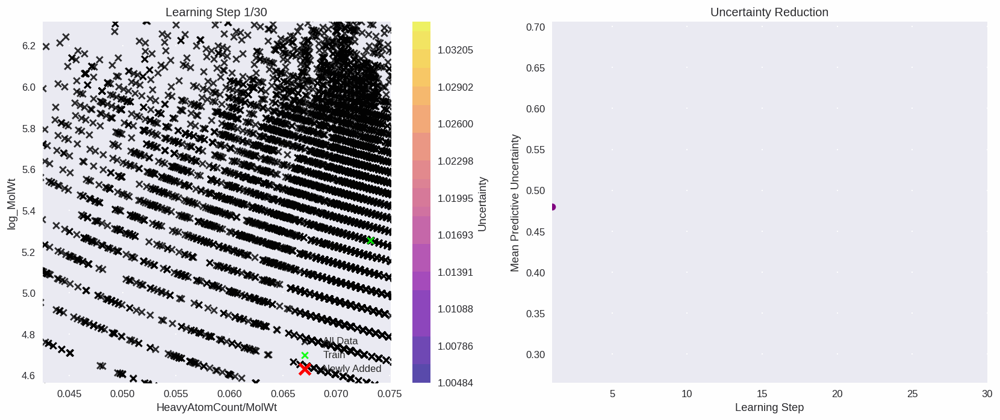
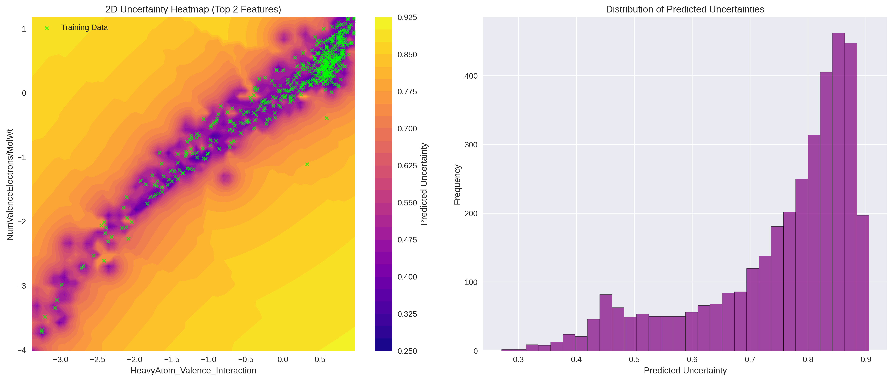

# Gaussian Processes - AqSolDB

<p align="center">
  
  <br>
  <em>Active Learning of Gaussian Process</em>
</p>

<p align="center">
  
  <br>
  <em>Uncertainty distribution in most important features</em>
</p>

## Setup

Need [Conda](https://docs.conda.io/projects/conda/en/latest/user-guide/install/index.html). Choose your favourite installer. 

Then can use the Makefile:

```bash
# See all available commands
make help

# Quick start
make install    # Install everything
make test       # Run tests
make run-gp    # Run the standard GP
```


## Developing

**Recommended**: Use the dev environment and tmux for the best experience:

```bash
make dev                    # Start development session
tmux attach-session -t gp_dev  # Attach to session
```

**Note**: [jax_dataclass](https://github.com/brentyi/jax_dataclasses) package is not type-safe.

## Data

The [AqSolDB](https://doi.org/10.1038/s41597-019-0151-1) dataset in this repository comprises curated experimental solubility values, made openly accessible by the Autonomous Energy Materials Discovery research group.

## References

- [GPs](https://direct.mit.edu/books/oa-monograph/2320/Gaussian-Processes-for-Machine-Learning)
- [Sparse FITC GPs](https://arxiv.org/abs/1606.04820)
- [GP-Kolmogorov-Arnold Networks](https://arxiv.org/abs/2407.18397)
- [AqSolDB](https://doi.org/10.1038/s41597-019-0151-1)